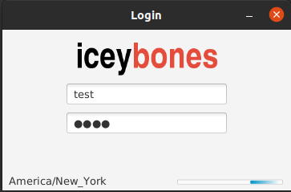
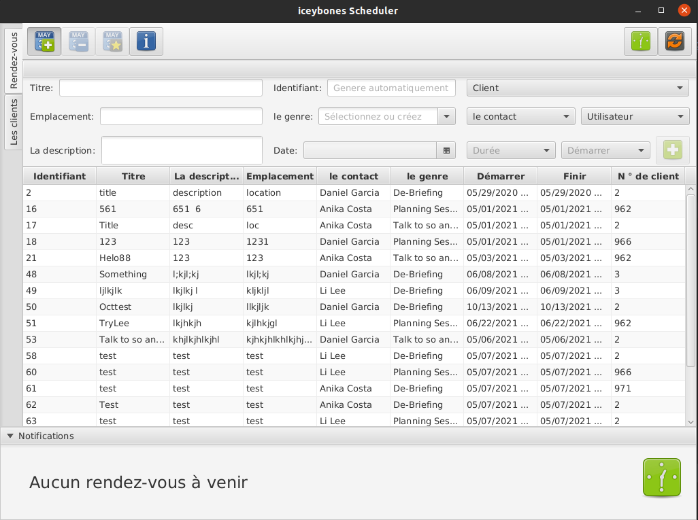
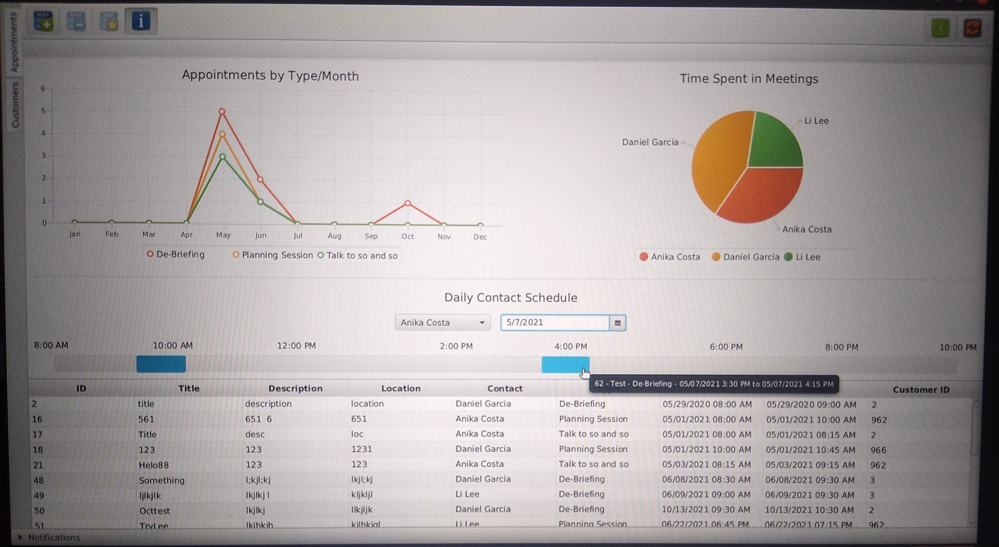

<h3> iceybones Scheduler - A simple customer and appointment management application </h3>

Author: Christopher Griswold - cgrisw4@wgu.edu

Version: 1.0

Date: 05/06/2021

IDE: IntelliJ Community 2021.1.1

JDK: openjdk version "11.0.8" 2020-07-14 LTS

JavaFX: JavaFX-SDK-11.0.2

MySQL Connector: mysql-connector-java-8.0.22

How to run on Windows: With Java 11 installed, simply [download the Launcher](./out/artifacts/Launcher_WIN_jar/Launcher_WIN.jar) and run it.

How to run on Linux: With Java 11 installed, [download the Launcher](./out/artifacts/Launcher_jar/Launcher.jar), open a terminal at the directory where the jar is and run the command "java -jar Launcher.jar".

How to run inside IntelliJ: With all the necessary componens installed and configured, create a new run configuration and 
	add the following VM options "--module-path $PATH_TO_FX --add-modules javafx.controls,javafx.fxml". Press the green RUN icon.

